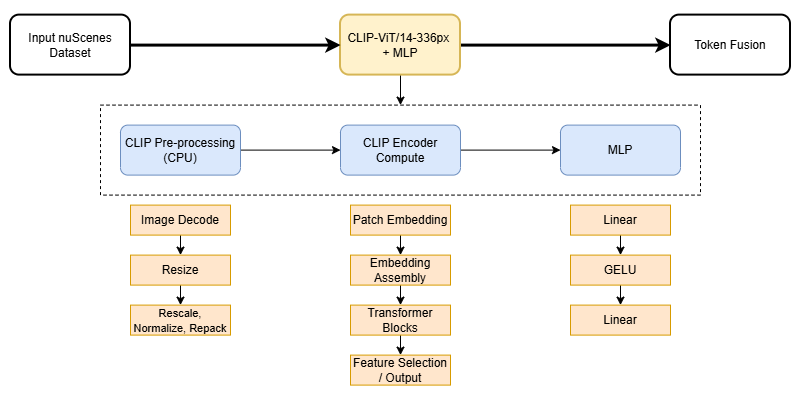

# CLIP Encoder + MLP Projector Benchmarking Subsystem (NVIDIA Implementation)
 
> Owner: Travis Mora · Last updated: 10/6/2026
 
CLIP Encoder and MLP subsystem benchmarking harness for Autonomous Vehicle VLM pipeline referenced from [1]. Inputted nuScenes dataset and outputs 577 tokens with 2048 dimensions, later fed into the TinyLlama LLM.

 

 
## 1. Scope
 
Frozen CLIP ViT-L/14-336px vision encoder plus the two-layer MLP projector.
Feature extraction only — the CLIP text encoder, final projection layer, and
candidate-label comparison are not used.
 

 
Notes on the cut points: <why these boundaries and not others; relation to the
3-stage decomposition the sponsor asked for>.
 
**Out of scope:** <what belongs to teammates' subsystems — name them so there is
no overlap or gap at the seams>.
 
 
## 2. Inputs
 
- Source: <dataset / sample images, path or how to obtain>
- Format: <file type, color space, expected resolution on disk>
- Preprocessing applied: resize/crop to 336×336, normalization constants
  `mean = <...>`, `std = <...>`
- Batch layout: <NCHW, batch sizes supported>
- Precision: <fp32 / fp16 / bf16 / int8 — which are supported per target>

 
## 3. Outputs
 
- Tensor shape: 576 tokens × 2048 dims (post-projection)
- dtype / device: <...>
- Token ordering, CLS handling: <...>
- Handoff format to the language stage: <in-memory tensor / .pt / .npy, path
  convention>
- Side artifacts: <timing logs, power logs — where they are written>

 
## 4. Environment and usage
 
### Pinned versions
 
| Component | Jetson AGX Orin | Tenstorrent p150a |
|---|---|---|
| OS / JetPack |26.2.1+b38 | — |
| CUDA | | — |
| TT-Forge / TT-Metal | — | |
| Card firmware | — | <note active Tensix core count> |
| torch | | |
| transformers | | |
| Python | | |
 
### Weights
 

### Setup
 
 
### Run
 
 

 
## 5. Benchmarking methodology
 
Metric definitions apply to all submodules unless an exception is noted.
 
- **Warmup:** 
- **Measured runs:** 
- **Latency timing:** 
- **Throughput:** 
- **Power:** 
- **Memory:** 
- **Thermal / clock state:** 
- **Determinism:** 
 

 
## 6. Validation
 
 
## 7. Results
 
 
## 8. Limitations
 

## 9. References
 
- StudentVLM — <full citation / link>
- CLIP — Radford et al., arXiv:2103.00020
- LLaVA-1.5 — Liu et al., arXiv:2310.03744 (origin of the two-layer MLP projector)

## Changelog
 
 
| Date | Commit | Change | Affects results? |
|---|---|---|---|
| | | | |
 